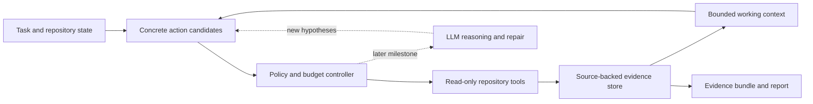

# Jev Scout

**An evidence-first runtime for investigating code under a bounded budget.**

Jev Scout explores a repository, keeps source-backed observations recoverable, and hands bounded working context alongside inspectable evidence to a developer or a coding agent. Its research goal is to determine when a decision model such as Jev can improve the cost and reliability of code investigation.

**Status:** M1 implementation, alpha. The local investigator runs offline with a deterministic rule policy. Jev integration and automated repair are subsequent milestones; no efficiency or repair-success claims have been established.

[Quick start](#quick-start) · [Architecture](docs/architecture.md) · [Demo](docs/demo.md) · [Roadmap](docs/roadmap.md) · [Evaluation](docs/evaluation.md)

## The problem

Repository investigation consumes time and model context before a coding agent can propose a useful change. Search results, repeated file reads, and partially tested hypotheses accumulate. Compacting that history can remove evidence that becomes important later.

Jev Scout treats investigation as a sequence of explicit decisions:

1. **Acquire:** which concrete operation can answer an unresolved question?
2. **Retain:** which observations belong in the current working context?
3. **Escalate:** when do existing candidates stop making progress and require new reasoning?

The runtime keeps the evidence behind those decisions inspectable. A selected file is a lead; an observation is not automatically a root cause; a model's confidence is not a correctness guarantee.

## Architecture

This is the target architecture. M1 discovers a fixed lexical frontier once and reads selected excerpts; adaptive search and model reasoning are later extensions.



**Concrete candidates** carry executable parameters. The decision layer selects a candidate ID rather than inventing shell commands. **Evidence** keeps source locations and content fingerprints. **Working context** is a bounded view of that evidence, so removing an observation from context does not destroy its original record.

The first policy is deterministic and runs without an API key. Jev is planned as the first remote decision backend behind the `Policy.choose(state, candidates)` interface. This separation provides a meaningful baseline and keeps the project usable when a model is unavailable.

See the [architecture document](docs/architecture.md) and [first design decision](docs/adr/0001-evidence-first-runtime.md) for boundaries and tradeoffs.

## Incremental delivery

| Milestone | Deliverable | Acceptance question |
| --- | --- | --- |
| M1 — Local evidence baseline | Read-only investigation, bounded context, raw events, evidence bundle, source-linked report | Can a run preserve and expose useful source evidence reproducibly? |
| M2 — Jev decision backend | Typed decisions, explicit fallback, usage accounting, backend comparisons | Does Jev improve candidate selection over the rule baseline? |
| M3 — Repair and evaluation | Fixed downstream solver, executable verification, paired experiments | Does investigation improve the success–cost tradeoff end to end? |
| M4 — Repository memory | Version-aware reuse, invalidation, chronological evaluation | When does accumulated experience help, and when should it be ignored? |

The runnable M1 baseline is available in [PR #5](https://github.com/jinshendan/jev-scout/pull/5). See the [implementation branch and quick start](https://github.com/jinshendan/jev-scout/tree/feat/local-evidence-baseline#quick-start) to try it during review. Each later milestone will be delivered in focused PRs with an updated roadmap and relevant verification. See [open issues](https://github.com/jinshendan/jev-scout/issues) for the active work.

## Quick start

Requires **Python 3.11+ on macOS or Linux**. The runtime uses the Python standard library. There is no PyPI release yet; install from a checkout. During review, the executable baseline is on `feat/local-evidence-baseline`.

```sh
git clone --branch feat/local-evidence-baseline https://github.com/jinshendan/jev-scout.git
cd jev-scout
python3 -m venv .venv
source .venv/bin/activate
python -m pip install -e .

scout investigate \
  --repo examples/cancellation \
  --task "Investigate whether Request::cancel removes queued callbacks." \
  --output .scout/demo \
  --max-steps 6 \
  --max-context-chars 1200
```

Open `.scout/demo/report.md` and compare its citations with the source. The [walkthrough](docs/demo.md) explains what the example can establish.

| Artifact | What it contains |
| --- | --- |
| `report.md` | Source-linked excerpts, coverage limits, and stopping reason |
| `evidence.json` | Versioned observations, source fingerprints, candidates, and active context |
| `events.jsonl` | Ordered decisions, reads, context changes, and source revalidation |

Choose a fresh output directory **outside the repository being investigated**. In this example, `.scout/demo` is outside `examples/cancellation`. For another repository:

```sh
scout investigate --repo /path/to/repository \
  --task "Trace the cancellation path for Request::cancel" \
  --output /tmp/scout-investigation-001
```

`--max-steps` bounds snippet actions, including skipped actions. `--max-context-chars` bounds active excerpt characters, not tokens or the size of retained artifacts. The result also records fixed discovery, source-read, and candidate limits. Reuse an observation by its ID in `evidence.json`; automatic run resumption is future work.

## Implemented in M1

- Local text-based discovery and bounded snippet reads.
- Explicit action candidates and a replaceable policy interface.
- Source fingerprints and observation IDs.
- Context eviction with original evidence retained.
- English Markdown and JSON handoff artifacts.
- A small [C++ cancellation scenario](examples/cancellation/README.md) for inspecting the workflow.

M1 is a lexical source inspector. It does not provide semantic C++ analysis, automatic diagnosis, code edits, test execution, or measured token savings. Working-context eviction retains the original recorded excerpt; it does not archive the entire source file.

## Development

```sh
python -m pip install -e '.[dev]'
ruff check .
ruff format --check .
python -m unittest discover -s tests -v
python -m build
```

CI validates the package and CLI on Linux and macOS. Tests cover source-access boundaries, budgets, changed source, deterministic selection, and recoverable context. See [CONTRIBUTING.md](CONTRIBUTING.md) for the development and PR workflow.

## Research discipline

The primary outcome is task quality at a measured total cost, not a smaller prompt in isolation. Comparisons will include simple output masking, structural retrieval, rule-based selection, and ordinary summarization. Cold-start indexing, caches, failed attempts, retries, and downstream repair must be accounted for.

Related work already covers repository maps, inexpensive exploration, and repository memory. The open question here is how candidate coverage, recoverable evidence, and escalation interact in a complete investigation loop. See the [evaluation plan](docs/evaluation.md) for sources, baselines, and protocol constraints.

## Contributing

The project is implemented and documented in English. Small contributions with clear behavior and validation are welcome. Start with [CONTRIBUTING.md](CONTRIBUTING.md); substantial design choices belong in [architecture decision records](docs/adr/).

## License

[MIT](LICENSE). Jev Scout is an independent project and is not affiliated with TypeSafe AI. The project license does not cover external model services or grant access to model weights.
