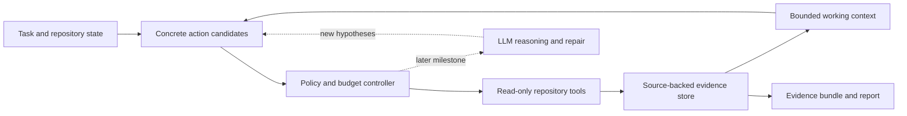

# Jev Scout

[English](README.md) · [简体中文](README.zh-CN.md)

**An evidence-first runtime for investigating code under a bounded budget.**

Jev Scout explores a repository, keeps source-backed observations recoverable, and hands bounded working context alongside inspectable evidence to a developer or a coding agent. Its research goal is to determine when a decision model such as Jev can improve the cost and reliability of code investigation.

**Status:** Alpha, version 0.5.0. The offline investigator, optional typed Jev selector, **explicit evidence recovery**, **frozen policy-comparison harness**, **opt-in adjacent-source follow-ups**, and **policy-selected context restoration** are implemented. Cross-file expansion, live provider validation, repair evaluation, and repository memory remain unfinished. No efficiency or repair-success claims have been established.

[Quick start](#quick-start) · [Follow-ups](docs/follow-up-evidence.md) · [Context restoration](docs/policy-context-restoration.md) · [Recovery](docs/evidence-recovery.md) · [Comparisons](docs/policy-comparison.md) · [Jev policy](docs/jev-policy.md) · [Architecture](docs/architecture.md) · [Roadmap](docs/roadmap.md)

## The problem

Repository investigation consumes time and model context before a coding agent can propose a useful change. Search results, repeated file reads, and partially tested hypotheses accumulate. Compacting that history can remove evidence that becomes important later.

Jev Scout treats investigation as a sequence of explicit decisions:

1. **Acquire:** which concrete operation can answer an unresolved question?
2. **Retain:** which observations belong in the current working context?
3. **Escalate:** when do existing candidates stop making progress and require new reasoning?

The runtime keeps the evidence behind those decisions inspectable. A selected file is a lead; an observation is not automatically a root cause; a model's confidence is not a correctness guarantee.

## Architecture

This is the target architecture. The current runtime discovers a lexical frontier once and reads selected excerpts. By default that frontier stays fixed. Opt-in follow-ups let the runtime offer bounded neighboring snippets in a successfully inspected file; rules or Jev select from the offered IDs. With restoration enabled, the runtime also offers previously evicted observations for source-validated reuse during the same run. Cross-file search and model reasoning are later extensions.



**Concrete candidates** carry executable parameters. The decision layer selects a candidate ID rather than inventing shell commands. **Evidence** keeps source locations and content fingerprints. **Working context** is a bounded view of that evidence, so removing an observation from context does not destroy its original record.

The default policy is deterministic and runs without an API key. Explicitly selecting Jev enables a remote backend behind `Policy.choose(state, candidates)`. Jev chooses an existing candidate ID; local code validates the response and executes the selected read or restoration. Provider failures and low-confidence answers fall back to rules while remaining visible in the trace.

Explicit recovery rebuilds bounded context from retained observation IDs after checking them against current source. Comparisons capture one bounded initial frontier and source snapshot for both policies, so later source changes cannot give the two arms different read content. With follow-ups enabled, each arm's later menus depend on its own choices while sharing the same expansion rules and limits.

See the [architecture document](docs/architecture.md) and [design decisions](docs/adr/) for boundaries and tradeoffs.

## Incremental delivery

| Milestone | Deliverable | Acceptance question |
| --- | --- | --- |
| M1 — Local evidence baseline | Available on main: read-only investigation, bounded context, raw events, evidence bundle, source-linked report | Can a run preserve and expose useful source evidence reproducibly? |
| M2 — Jev decision backend | Typed selection, fallback, accounting, explicit recovery, frozen comparisons, and bounded same-file follow-ups. Policy-selected restoration is also available. Cross-file expansion and live validation remain pending. | Does Jev improve candidate selection over the rule baseline? |
| M3 — Repair and evaluation | Fixed downstream solver, executable verification, paired experiments | Does investigation improve the success–cost tradeoff end to end? |
| M4 — Repository memory | Version-aware reuse, invalidation, chronological evaluation | When does accumulated experience help, and when should it be ignored? |

The M1 baseline and M2a adapter were delivered in [PR #5](https://github.com/jinshendan/jev-scout/pull/5) and [PR #6](https://github.com/jinshendan/jev-scout/pull/6). [PR #7](https://github.com/jinshendan/jev-scout/pull/7) adds M2b recovery and controlled comparison inputs; [PR #9](https://github.com/jinshendan/jev-scout/pull/9) adds M2c neighboring evidence; [PR #10](https://github.com/jinshendan/jev-scout/pull/10) adds M2d context restoration. Each milestone is delivered in focused PRs with an updated roadmap and relevant verification. See [open issues](https://github.com/jinshendan/jev-scout/issues) for the active work.

## Quick start

Requires **Python 3.11+ on macOS or Linux**. The runtime uses the Python standard library. There is no PyPI release yet; install from a checkout.

The examples retain English task text because the current lexical search extracts ASCII identifiers from the task.

```sh
git clone https://github.com/jinshendan/jev-scout.git
cd jev-scout
python3 -m venv .venv
source .venv/bin/activate
python -m pip install -e .

scout investigate \
  --repo examples/cancellation \
  --task "Investigate whether Request::cancel removes queued callbacks." \
  --output .scout/demo \
  --max-steps 6 \
  --max-context-chars 1200
```

Open `.scout/demo/report.md` and compare its citations with the source. The [walkthrough](docs/demo.md) explains what the example can establish.

| Artifact | What it contains |
| --- | --- |
| `report.md` | Source-linked excerpts, coverage limits, policy accounting, and stopping reason |
| `evidence.json` | Schema 3: observations, source fingerprints, candidates, active context, and decision traces |
| `events.jsonl` | Ordered decisions, inspectable request payloads, reads, context changes, and source revalidation |

Choose a fresh output directory **outside the repository being investigated**. In this example, `.scout/demo` is outside `examples/cancellation`. For another repository:

```sh
scout investigate --repo /path/to/repository \
  --task "Trace the cancellation path for Request::cancel" \
  --output /tmp/scout-investigation-001
```

`--max-steps` bounds all selected read and restoration actions, including skipped actions. `--max-context-chars` bounds active excerpt characters, not tokens or the size of retained artifacts. The result also records fixed discovery, source-read, and candidate limits. Automatic run resumption is future work.

## Request neighboring source evidence

Enable a bounded expansion beyond the initial lexical windows:

```sh
scout investigate \
  --repo examples/cancellation \
  --task "Investigate whether Request::cancel removes queued callbacks." \
  --output .scout/followup-demo \
  --max-steps 12 \
  --max-context-chars 1200 \
  --max-followups 6
```

After a successful hash-matching read, the runtime can offer up to two adjacent snippets in the same file, each at most nine lines. The existing policy selects these candidates; Jev cannot invent coordinates. `--max-followups` accepts 0–100 and defaults to `0`, preserving the fixed-frontier baseline. The quota counts generated offers, whether or not they are selected. Initial, follow-up, and restoration candidates together are capped at 100, and every selected action shares the existing `--max-steps` budget.

Inspect `expansion` and `generated_candidate_lineage` in `evidence.json`, plus the ordered events, to see limits, parent candidates, parent observations, and directions. Follow-ups do not scan new files or guarantee whole-file coverage. Context restoration has its own opt-in quota. See the [follow-up guide](docs/follow-up-evidence.md).

## Restore context during an investigation

Enable policy-selectable reuse of evidence evicted from this run's working context:

```sh
scout investigate \
  --repo examples/cancellation \
  --task "Investigate whether Request::cancel removes queued callbacks." \
  --output .scout/restoration-demo \
  --max-steps 12 \
  --max-context-chars 40 \
  --max-restores 3
```

`--max-restores` accepts 0–100 and defaults to `0`. It limits generated restoration offers, including offers never selected. Each evicted observation can receive at most one runtime-generated `restore_observation` candidate. The policy chooses an offered ID; local code rechecks the safe source path, hash, exact excerpt, and truncation before reinserting the original observation into bounded FIFO context. Historical evidence remains intact when source has changed or a restoration is skipped.

Restoration consumes the same step budget and shared 100-candidate cap as reads and follow-ups. It preserves the original observation ID and creates no new raw observation. The rule baseline prioritizes unseen reads before restoration offers; Jev can select either kind from the validated menu. This is bounded recall within one run, with no measured quality benefit. See the [context restoration guide](docs/policy-context-restoration.md).

## Recover evidence and compare policies

Recover a retained observation even if it was evicted from the original working context:

```sh
scout recover \
  --evidence .scout/demo/evidence.json \
  --repo examples/cancellation \
  --observation o0001 \
  --output .scout/recovery \
  --max-context-chars 1200
```

Use IDs from your `evidence.json`; repeat `--observation` to request more than one. Recovery preserves requested historical excerpts and rechecks source hashes, spans, and text. Only matching current evidence enters the new bounded context. Inspect `recovery.json` and `report.md` for stale or unavailable evidence. See the [recovery guide](docs/evidence-recovery.md).

Run an offline rule-versus-rule sanity comparison over shared captured inputs:

```sh
scout compare \
  --repo examples/cancellation \
  --task "Investigate whether Request::cancel removes queued callbacks." \
  --output .scout/comparison \
  --max-steps 6 \
  --max-context-chars 1200
```

The result contains `comparison.json`, `report.md`, and each arm's normal artifacts under `rule/` and `challenger/`. Read the [comparison guide](docs/policy-comparison.md) before adding `--challenger jev`: that enables remote source transmission and requires `TYPESAFE_API_KEY`. Shared inputs and behavioral diagnostics make a comparison inspectable; they do not establish evidence quality or repair success.

`compare` also accepts `--max-followups` and `--max-restores`. Both arms share captured source, the initial frontier, and expansion/restoration settings; their later offered candidates can diverge after different choices. Comparison schema 3 matches actions by kind, source identity, and span rather than arm-local candidate or observation IDs. Restoration checks captured source, while the live checkout is checked separately.

All output directories must be fresh and outside the investigated repository. Choose new names when repeating these examples.

## Optional Jev selection

The quick start uses `--policy rule` by default and makes no network requests. To enable Jev, set `TYPESAFE_API_KEY` in your environment, then run:

```sh
scout investigate \
  --repo examples/cancellation \
  --task "Investigate whether Request::cancel removes queued callbacks." \
  --output .scout/jev-demo \
  --policy jev \
  --jev-model jev-1.13.0 \
  --jev-max-calls 8
```

**Selecting Jev sends the task, candidate descriptions with relative source paths and previews, and active source excerpts to TypeSafe AI.** Request payloads are retained in local artifacts for inspection. Keep artifacts private when investigating private source. API keys, authorization headers, and provider error bodies are excluded from artifacts.

Jev selects from the same unseen offered read and restoration candidates as the rule baseline. Requests that exceed the byte limit fall back without a network call; candidates are not silently dropped to fit. Exhausted call budgets, invalid responses, provider errors, and answers below the confidence floor also use explicit rule fallback. Missing credentials are a setup error. There are no automatic retries.

See the [Jev policy guide](docs/jev-policy.md) for all limits, the official API contract, and fallback accounting. Tests use controlled HTTP fixtures; an authenticated live-provider run has not been validated. Confidence describes the returned distribution, not the probability of solving the task.

## Implemented in M1

- Local text-based discovery and bounded snippet reads.
- Explicit action candidates and a replaceable policy interface.
- Source fingerprints and observation IDs.
- Context eviction with original evidence retained.
- English Markdown and JSON handoff artifacts.
- A small [C++ cancellation scenario](examples/cancellation/README.md) for inspecting the workflow.

M1 is a lexical source inspector. It does not provide semantic C++ analysis, automatic diagnosis, code edits, test execution, or measured token savings. Working-context eviction retains the original recorded excerpt; it does not archive the entire source file.

## Implemented in M2a

- Opt-in Jev Choice requests over existing candidate IDs.
- Local response validation and explicit deterministic fallback.
- Provider call and payload limits with no automatic retries.
- Schema 2 decision traces with requested and returned models, distributions, latency, and reported usage.

M2a changes candidate selection within the fixed frontier. It does not generate queries, recover evicted context automatically, edit code, add a solver, or create persistent repository memory. Those are tracked separately in the [roadmap](docs/roadmap.md).

## Implemented in M2b

- Explicit observation recovery from schema 1, 2, or 3 bundles, with bounded imports and current-source validation.
- Retention of historical excerpts while excluding changed, unavailable, or mismatched evidence from active context.
- One captured frontier, task, read content, and budget configuration shared by both comparison arms.
- Separate snapshot provenance, checkout revalidation, setup/arm timing, and provider accounting.
- Offline rule-versus-rule sanity checks and opt-in rule-versus-Jev comparisons.

The captured source is bounded and sequential, not an atomic repository snapshot or Git commit. Agreement and overlap describe policy behavior; they are not correctness scores. Recovery does not resume a run or prove an imported artifact's authenticity. See [ADR 0003](docs/adr/0003-recovery-and-frozen-comparisons.md).

## Implemented in M2c

- Optional same-file adjacent windows after successful source-validated reads.
- A generated-offer quota, a shared 100-candidate cap, and unchanged read/context budgets.
- Parent candidate/observation lineage and explicit expansion accounting in events, evidence, and reports.
- Frozen comparisons with the same initial frontier and expansion settings, independent later menus, and semantic action agreement.

This increment provides bounded neighboring evidence. Cross-file discovery and a repair solver remain later work; M2d adds a separate restoration option. Nine-line windows and 4,000-character excerpts can leave gaps or truncate long lines. See [ADR 0004](docs/adr/0004-bounded-follow-up-evidence.md).

## Implemented in M2d

- Opt-in policy-selected restoration of context-evicted observations during a run.
- One concrete restoration offer per observation, with offer, global candidate, and shared action budgets.
- Safe source/hash/span/excerpt checks before reusing the original observation ID and text.
- Schema 3 investigation and comparison artifacts with restoration accounting and semantic action identity.
- Frozen comparison restoration against captured source, and explicit manual recovery compatible with schemas 1, 2, and 3.

Restoration can revisit retained evidence without reconstructing a new observation. It does not resume an earlier run, discover new files, establish a diagnosis, or validate live Jev behavior. See [ADR 0005](docs/adr/0005-policy-context-restoration.md).

## Development

```sh
python -m pip install -e '.[dev]'
ruff check .
ruff format --check .
python -m unittest discover -s tests -v
python -m build
```

CI validates the package and CLI on Linux and macOS. Tests cover source-access boundaries, budgets, changed source, deterministic selection, recoverable context, and provider contract/fallback behavior without a live key. See [CONTRIBUTING.md](CONTRIBUTING.md) for the development and PR workflow.

## Research discipline

The primary outcome is task quality at a measured total cost, not a smaller prompt in isolation. Comparisons will include simple output masking, structural retrieval, rule-based selection, and ordinary summarization. Cold-start indexing, caches, failed attempts, retries, and downstream repair must be accounted for.

Related work already covers repository maps, inexpensive exploration, and repository memory. The open question here is how candidate coverage, recoverable evidence, and escalation interact in a complete investigation loop. See the [evaluation plan](docs/evaluation.md) for sources, baselines, and protocol constraints.

## Contributing

Project introductions are available in English and Simplified Chinese and maintained together. Code, comments, CLI output, API/schema names, runtime-authored report text, and technical reference guides use English; source excerpts retain their original language. Small contributions with clear behavior and validation are welcome. Start with [CONTRIBUTING.md](CONTRIBUTING.md); substantial design choices belong in [architecture decision records](docs/adr/).

## License

[MIT](LICENSE). Jev Scout is an independent project and is not affiliated with TypeSafe AI. The project license does not cover external model services or grant access to model weights.
