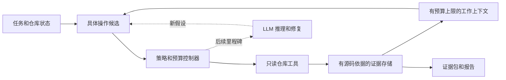

# Jev Scout

[English](README.md) · [简体中文](README.zh-CN.md)

**在有限预算内调查代码、以证据为核心的运行时。**

Jev Scout 探索代码仓库，让有源码依据的观察记录可以恢复，并将受预算约束的工作上下文和可检查的证据交给开发者或编码代理。它的研究目标是判断：Jev 这样的决策模型在什么情况下能够改善代码调查的成本与可靠性。

**当前状态：** Alpha，版本 0.4.0。已实现离线调查器、可选的类型化 Jev 选择器、**显式证据恢复**、**使用冻结输入的策略比较工具**和**可选的相邻源码扩展**。跨文件扩展、自动恢复、真实服务验证、修复评测和仓库记忆尚未完成。目前尚未证明效率提升或修复成功率提升。

[快速开始](#快速开始) · [相邻源码扩展（英文）](docs/follow-up-evidence.md) · [证据恢复（英文）](docs/evidence-recovery.md) · [策略比较（英文）](docs/policy-comparison.md) · [Jev 策略（英文）](docs/jev-policy.md) · [架构](docs/architecture.zh-CN.md) · [路线图](docs/roadmap.zh-CN.md)

## 要解决的问题

编码代理在提出有用的修改之前，调查代码仓库就已经消耗了时间和模型上下文。搜索结果、反复读取的文件和只得到部分检验的假设会不断积累。压缩这些历史记录时，可能删掉后来才变得重要的证据。

Jev Scout 将调查视为一系列明确的决策：

1. **获取：** 哪一个具体操作能回答尚未解决的问题？
2. **保留：** 哪些观察记录应该进入当前工作上下文？
3. **升级：** 现有候选何时不再带来进展，需要引入新的推理？

运行时让这些决策背后的证据保持可检查。选中的文件只是线索；观察记录不会自动成为根因；模型的置信度也不是正确性保证。

## 架构

下图展示目标架构。当前运行时只发现一次词法候选集合，然后读取选中的片段。默认情况下，该集合保持固定。显式启用扩展后，运行时可以在成功检查的文件中提供有上限的相邻片段；规则或 Jev 从这些候选 ID 中选择。跨文件搜索和模型推理属于后续扩展。



**具体候选**携带可执行的参数。决策层选择候选 ID，而不是自行生成 shell 命令。**证据**保留源码位置和内容指纹。**工作上下文**是证据的一份受预算约束的视图，因此从上下文中移除一条观察记录，不会销毁其原始记录。

默认策略具有确定性，不需要 API Key。显式选择 Jev 时，会通过 `Policy.choose(state, candidates)` 接口启用远程后端。Jev 选择已有的候选 ID；本地代码校验响应并执行读取。服务错误和低置信度回答会回退到规则策略，并在轨迹中留下记录。

显式恢复会根据保留的观察记录 ID，在核对当前源码后重建受预算约束的上下文。策略比较为两个策略捕获同一份有预算上限的初始候选集合与源码快照，因此后续源码变化不会让两个比较分支读到不同内容。启用相邻扩展后，各分支后续的候选菜单取决于自己的选择，但共享同样的扩展规则和限制。

边界与取舍见[架构文档](docs/architecture.zh-CN.md)和[架构决策记录（英文）](docs/adr/)。

## 分阶段交付

| 里程碑 | 交付内容 | 验收问题 |
| --- | --- | --- |
| M1 — 本地证据基线 | 已在 main 提供：只读调查、受预算约束的上下文、原始事件、证据包和带源码引用的报告 | 一次运行能否以可复现的方式保留并展示有用的源码证据？ |
| M2 — Jev 决策后端 | 类型化选择、回退、用量记录、显式恢复、冻结输入比较和有上限的同文件相邻扩展。跨文件扩展、自动恢复和真实服务验证仍待完成。 | 与规则基线相比，Jev 能否改善候选选择？ |
| M3 — 修复与评测 | 固定的下游求解器、可执行验证、配对实验 | 调查能否改善端到端成功率与成本之间的权衡？ |
| M4 — 仓库记忆 | 版本感知的复用、失效处理、按时间顺序评测 | 积累的经验何时有帮助，何时应该忽略？ |

M1 基线和 M2a 适配器分别通过 [PR #5](https://github.com/jinshendan/jev-scout/pull/5) 和 [PR #6](https://github.com/jinshendan/jev-scout/pull/6) 交付。[PR #7](https://github.com/jinshendan/jev-scout/pull/7) 增加了 M2b 的恢复能力和受控比较输入；[PR #9](https://github.com/jinshendan/jev-scout/pull/9) 增加了 M2c 的相邻证据读取。各里程碑通过范围明确的 PR 逐步交付，同时更新路线图并完成相关验证。当前工作见[开放的 issues](https://github.com/jinshendan/jev-scout/issues)。

## 快速开始

需要 **macOS 或 Linux 上的 Python 3.11+**。运行时使用 Python 标准库。目前尚未发布到 PyPI；请从仓库检出后安装。

示例保留英文任务文本，因为当前词法检索从任务中提取 ASCII 标识符。

```sh
git clone https://github.com/jinshendan/jev-scout.git
cd jev-scout
python3 -m venv .venv
source .venv/bin/activate
python -m pip install -e .

scout investigate \
  --repo examples/cancellation \
  --task "Investigate whether Request::cancel removes queued callbacks." \
  --output .scout/demo \
  --max-steps 6 \
  --max-context-chars 1200
```

打开 `.scout/demo/report.md`，将报告中的引用与源码对照。[演示指南](docs/demo.zh-CN.md)说明了这个示例能够支持哪些结论。

| 产物 | 内容 |
| --- | --- |
| `report.md` | 带源码引用的片段、覆盖范围限制、策略用量记录和停止原因 |
| `evidence.json` | Schema 2：观察记录、源码指纹、候选、活跃上下文和决策轨迹 |
| `events.jsonl` | 按顺序记录的决策、可检查的请求内容、读取、上下文变化和源码复核 |

请选择一个新的输出目录，且目录必须位于**被调查仓库之外**。本示例中的 `.scout/demo` 位于 `examples/cancellation` 之外。调查其他仓库时：

```sh
scout investigate --repo /path/to/repository \
  --task "Trace the cancellation path for Request::cancel" \
  --output /tmp/scout-investigation-001
```

`--max-steps` 限制片段操作次数，包括跳过的操作。`--max-context-chars` 限制活跃片段的字符数，不是 token 数，也不限制保留产物的大小。结果还会记录固定的发现、源码读取和候选数量限制。自动续跑属于后续工作。

## 请求相邻源码证据

启用有预算上限的扩展，继续查看初始词法窗口之外的片段：

```sh
scout investigate \
  --repo examples/cancellation \
  --task "Investigate whether Request::cancel removes queued callbacks." \
  --output .scout/followup-demo \
  --max-steps 12 \
  --max-context-chars 1200 \
  --max-followups 6
```

一次成功且源码哈希匹配的读取之后，运行时可以在同一文件中提供最多两个相邻片段，每个最多九行。已有策略负责选择这些候选；Jev 不能自行生成坐标。`--max-followups` 接受 0–100，默认值为 `0`，保留固定候选集合的基线行为。配额统计生成的候选，即使它们最后没有被选中。初始与新增候选总数最多为 100，所有被选中的读取共用原有的 `--max-steps` 预算。

查看 `evidence.json` 中的 `expansion`、`generated_candidate_lineage` 及有序事件，可以检查限制、父候选、父观察记录和方向。相邻扩展不会扫描新文件、自动恢复上下文，也不保证覆盖整个文件。详见[相邻源码扩展指南（英文）](docs/follow-up-evidence.md)。

## 恢复证据与比较策略

即使一条保留的观察记录已被移出原始工作上下文，也可以恢复它：

```sh
scout recover \
  --evidence .scout/demo/evidence.json \
  --repo examples/cancellation \
  --observation o0001 \
  --output .scout/recovery \
  --max-context-chars 1200
```

请使用你的 `evidence.json` 中的 ID；重复传入 `--observation` 可请求多条记录。恢复会保留请求的历史片段，并重新核对源码哈希、行范围和文本。只有与当前源码一致的证据会进入新的受预算约束的上下文。过期或不可用的证据见 `recovery.json` 和 `report.md`。详见[证据恢复指南（英文）](docs/evidence-recovery.md)。

使用共同捕获的输入，离线比较规则策略与规则策略，检查比较流程的一致性：

```sh
scout compare \
  --repo examples/cancellation \
  --task "Investigate whether Request::cancel removes queued callbacks." \
  --output .scout/comparison \
  --max-steps 6 \
  --max-context-chars 1200
```

结果包含 `comparison.json`、`report.md`，以及 `rule/` 和 `challenger/` 下各比较分支的常规产物。添加 `--challenger jev` 之前，请阅读[策略比较指南（英文）](docs/policy-comparison.md)：该选项会启用向远程服务传输源码内容，并需要 `TYPESAFE_API_KEY`。共同输入和行为诊断让比较过程可检查；它们本身不能证明证据质量或修复成功率。

`compare` 也接受 `--max-followups`。两个分支共享捕获的源码、初始候选集合和扩展设置；选择不同之后，后续提供的候选可能不同。比较 schema 2 按源码身份和行范围匹配动作，而不是按各分支内的候选 ID 匹配。

所有输出目录都必须是新的目录，并且位于被调查仓库之外。重复运行这些示例时，请使用新的目录名。

## 可选的 Jev 选择

快速开始默认使用 `--policy rule`，不会发起网络请求。启用 Jev 时，请在环境中设置 `TYPESAFE_API_KEY`，然后运行：

```sh
scout investigate \
  --repo examples/cancellation \
  --task "Investigate whether Request::cancel removes queued callbacks." \
  --output .scout/jev-demo \
  --policy jev \
  --jev-model jev-1.13.0 \
  --jev-max-calls 8
```

**选择 Jev 会将任务、带有相对源码路径和预览的候选描述，以及活跃源码片段发送给 TypeSafe AI。** 请求内容会保留在本地产物中，供检查。调查私有源码时，请保持产物私密。产物不会包含 API Key、授权请求头和服务错误响应体。

Jev 与规则基线面对的是同一批尚未读取的候选。超过字节限制的请求会在不发起网络调用的情况下回退；不会为了满足限制而静默删减候选。调用预算耗尽、无效响应、服务错误和低于置信度下限的回答，也会显式回退到规则策略。缺少凭证属于配置错误。没有自动重试。

全部限制、官方 API 契约和回退统计见 [Jev 策略指南（英文）](docs/jev-policy.md)。测试使用受控 HTTP 测试夹具；尚未验证需要认证的真实服务运行。置信度描述返回的分布，不代表解决任务的概率。

## M1 已实现

- 基于本地文本的发现和受预算约束的片段读取。
- 明确的操作候选和可替换的策略接口。
- 源码指纹与观察记录 ID。
- 从上下文中移除记录时，保留原始证据。
- 英文 Markdown 和 JSON 交接产物。
- 用于检查工作流程的小型 [C++ 取消场景（英文）](examples/cancellation/README.md)。

M1 是词法源码检查器。它不提供 C++ 语义分析、自动诊断、代码修改、测试执行或经过测量的 token 节省。上下文移除会保留原来记录的片段，不会归档整个源文件。

## M2a 已实现

- 显式启用的 Jev Choice 请求，从已有候选 ID 中选择。
- 本地响应校验和明确的确定性回退。
- 服务调用次数与请求内容限制，无自动重试。
- Schema 2 决策轨迹，记录请求和返回的模型、分布、延迟及服务报告的用量。

M2a 改变固定候选集合中的选择方式。它不会生成查询、自动恢复被移出上下文的记录、修改代码、加入求解器或建立持久仓库记忆。这些工作在[路线图](docs/roadmap.zh-CN.md)中单独跟踪。

## M2b 已实现

- 从 schema 1 或 2 证据包中显式恢复观察记录，限制导入规模并核对当前源码。
- 保留历史片段，同时将已变化、不可用或不匹配的证据排除在活跃上下文之外。
- 两个比较分支共享同一份捕获的候选集合、任务、读取内容和预算配置。
- 分别记录快照来源、当前仓库副本复核、准备与分支耗时，以及服务用量。
- 离线规则对规则一致性检查，以及显式启用的规则对 Jev 比较。

源码捕获有规模限制，且按顺序进行，不是原子化仓库快照，也不是 Git 提交。选择一致率和重叠程度描述策略行为，不是正确性分数。恢复不会续跑调查，也不能证明导入产物的真实性。详见 [ADR 0003（英文）](docs/adr/0003-recovery-and-frozen-comparisons.md)。

## M2c 已实现

- 成功核对源码并读取之后，可选地提供同文件中的相邻窗口。
- 新增候选配额、共用的 100 个候选上限，以及原有的读取和上下文预算。
- 在事件、证据和报告中记录父候选与父观察关系，以及明确的扩展统计。
- 冻结输入比较共享初始候选与扩展设置，各分支拥有独立的后续菜单，并按动作的源码含义计算一致性。

这是有上限的相邻证据扩展，不是跨文件发现、自动恢复循环或修复求解器。九行窗口和 4,000 字符的片段可能留下覆盖缺口，或截断长行。详见 [ADR 0004（英文）](docs/adr/0004-bounded-follow-up-evidence.md)。

## 开发

```sh
python -m pip install -e '.[dev]'
ruff check .
ruff format --check .
python -m unittest discover -s tests -v
python -m build
```

CI 在 Linux 和 macOS 上验证安装包与 CLI。测试在不使用真实 API Key 的情况下，覆盖源码访问边界、预算、源码变化、确定性选择、可恢复上下文，以及服务契约和回退行为。开发与 PR 流程见 [CONTRIBUTING.md（英文）](CONTRIBUTING.md)。

## 研究原则

主要衡量的是经过测量的总成本下的任务质量，不能只看提示词是否变短。比较将包括简单的输出遮蔽、结构化检索、规则选择和常规摘要。冷启动索引、缓存、失败尝试、重试和下游修复都必须纳入成本记录。

已有相关工作涉及仓库映射、低成本探索和仓库记忆。本项目的开放问题是：在完整调查循环中，候选覆盖、可恢复证据和升级决策如何相互影响。相关来源、基线与实验协议约束见[评测计划（英文）](docs/evaluation.md)。

## 贡献

项目介绍提供英文和简体中文版本，并同步维护。代码、代码注释、CLI 输出、API/schema 名称、运行时撰写的报告文字和技术参考指南使用英文；源码片段保留原始语言。欢迎行为清晰、验证充分的小范围贡献。请从 [CONTRIBUTING.md（英文）](CONTRIBUTING.md) 开始；重要的设计选择应记录在[架构决策记录（英文）](docs/adr/)中。

## 许可证

[MIT](LICENSE)。Jev Scout 是独立项目，与 TypeSafe AI 没有关联。项目许可证不涵盖外部模型服务，也不授予访问模型权重的权限。
